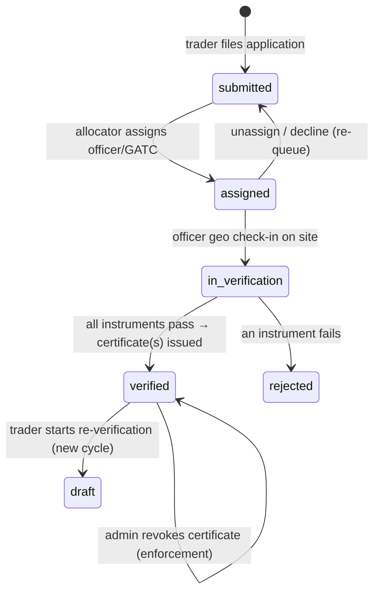
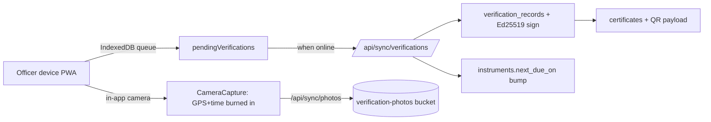

# MAAPSETU — Architecture

**MAAPSETU** (Online Verification & Certification of Weighing and Measuring
Instruments) is the SIH26036 solution for the Department of Consumer Affairs,
implementing the lifecycle mandated by the Legal Metrology Act, 2009 and the
Legal Metrology (General) Rules, 2011.

## 1. Stack

| Layer | Choice |
|---|---|
| Framework | Next.js 14 (App Router, React 18, TypeScript) |
| Styling | Tailwind CSS 3 (custom government design system) |
| Data + Auth | Supabase (PostgreSQL 15, Auth, Storage, Row Level Security) |
| Offline field app | PWA + Service Worker + IndexedDB (Dexie) |
| Certificate integrity | Ed25519 signatures (Node `crypto`), QR (`qrcode`) |
| Maps | Leaflet (field-ops live map) |
| Hosting | Vercel (app) + Supabase (Mumbai region) |

Fonts are the government-standard **Tiro Devanagari Hindi** (headings) and
**Mukta** (body), self-hosted via `next/font`, giving a bilingual (English /
हिन्दी) interface.

## 2. Application structure

```
src/
  app/
    page.tsx                     Landing (bilingual, government banner)
    verify/[cert]/               Public certificate verification (no auth)
    login, register, report      Public auth + complaints/feedback
    dashboard/
      layout.tsx                 Auth gate + role-aware nav
      trader/                    Businesses, instruments, applications, certificates
      officer/                   Field jobs, offline workspace, history
      allocator/                 Application queue, workload-aware allocation
      admin/                     Overview, field-ops, audit, users
      certificate/[id]/          Printable QR certificate
      search/                    Cross-entity record retrieval
    api/
      verify/[cert]             Public JSON verification
      sync/verifications        Offline record ingest + certificate issuance
      sync/photos               Field photo upload
      documents                 Supporting-document upload
      export/[dataset]          Role-gated CSV reports
      certificates/[id]/revoke  Enforcement: certificate revocation
  components/                    UI + dashboard + verify (NFC/QR/camera) components
  lib/                          rbac, audit, signature, qr, csv, documents, offline
supabase/migrations/            0001…0006 schema (see DEPLOYMENT.md)
```

## 3. Roles

`citizen · trader · officer · gatc · allocator · admin` (Postgres `user_role`
enum). Each dashboard is role-scoped in `dashboard/layout.tsx`; data access is
enforced in the database by RLS, not only in the UI (see SECURITY.md).

## 4. Verification workflow (the core lifecycle)

The application status enum is
`draft → submitted → assigned → in_verification → verified` with terminal
`rejected` / `cancelled`. Assignment sub-state is derived from timestamp
columns (`accepted_at`, `check_in_at`, `completed_at`).



Every stage is rendered as a live **workflow timeline**
(`components/dashboard/WorkflowTimeline.tsx`) on the trader and officer views,
derived entirely from existing tables — no extra schema.

Allocation (`dashboard/allocator`) ranks verifiers by **state match** and
**current open workload**, flags **SLA breaches** (waiting > 5 days), and
performs assign/reassign/unassign atomically through a server action
(`allocator/actions.ts`) with an audit entry.

## 5. Offline-first field capture



- Assignments are cached in IndexedDB (`lib/offline/db.ts`); observations queue
  locally and drain on reconnect (`lib/offline/sync.ts`).
- **Evidence integrity**: photos are captured *in-app only* (no gallery), with
  date-time and GPS coordinates burned into the image
  (`components/verify/CameraCapture.tsx`).

## 6. Public verification

Citizens verify with zero friction, three ways
(`components/verify/*`):
1. **Tap (Web NFC)** — reads an NFC tag with the phone's own radio.
2. **Scan (BarcodeDetector)** — in-page camera QR scan, no app install.
3. **Type** — the printed certificate number.

The public path uses a `SECURITY DEFINER` RPC `verify_certificate(cert_no)` so
no table is exposed. The QR carries an Ed25519 signature enabling offline
authenticity checks. See SECURITY.md.

## 7. Data model (summary)

`states/districts · profiles · businesses · instruments · applications ·
application_instruments · assignments · verification_records · certificates ·
certificate_scans · complaints · feedback · documents · gatc_centres ·
tolerances · notifications · audit_logs`, plus views `field_plan_today` and
`cert_scan_stats`. Full DDL in `supabase/migrations/`.

**Notifications & reminders.** A scheduled cron (`/api/cron/reminders`, secured
by `CRON_SECRET`, wired via `vercel.json`) sweeps `next_due_on` / `valid_until`
and writes `notifications` once per escalation window (dedupe_key), optionally
emailing via Resend. Assignment and verification events also create
notifications. The header bell shows the unread count; `/dashboard/notifications`
is the centre.

**GATC accreditation** (`gatc_centres`) records each Government Approved Test
Centre's registration, scope (instrument categories) and validity window;
allocation ranks GATC verifiers by accreditation validity and scope coverage.
**Tolerances** (`tolerances`) hold the maximum-permissible-error reference so the
field app derives pass/fail automatically from reference vs observed readings
(cached in IndexedDB for offline use).
