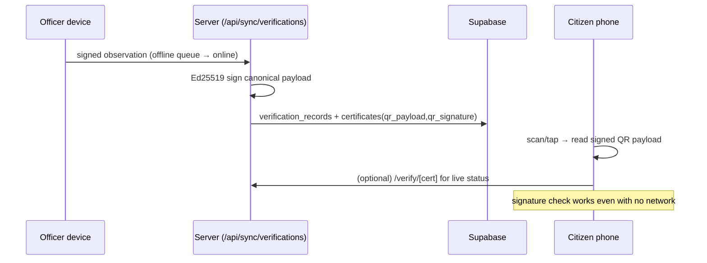

# MAAPSETU — Security Framework

## 1. Authentication

- Supabase Auth (email/password) issues JWTs held in HTTP-only cookies.
- A Postgres trigger (`handle_new_user`) provisions a `profiles` row on signup,
  defaulting to the least-privileged role `citizen`.
- `middleware.ts` runs **only** on `/dashboard/*` and redirects unauthenticated
  users to `/login`; public and verification pages never pay the auth round-trip.

## 2. Authorisation — defence in depth

Authorisation is enforced in **two independent layers**:

1. **UI / route layer** — `lib/rbac.ts` (`requireRole`, `getSessionProfile`)
   gates pages and API routes by role.
2. **Database layer (authoritative)** — Row Level Security on every table. Even
   a stolen anon key cannot read or write outside policy. Role checks use a
   `SECURITY DEFINER` helper `current_role_name()` reading the caller's profile.

Representative policies (see `supabase/migrations/0001_initial_schema.sql`):

- `applications` — a trader reads/writes only their own (and only while
  `draft`/`submitted`); allocators/admins read all; the assigned officer reads
  the applications assigned to them.
- `verification_records` — insert only by the officer/GATC who performed it.
- `certificates` — the owning trader and staff read; officers/GATCs/admins
  insert. Public reads go **only** through the `verify_certificate` RPC.
- `documents` — uploader or staff read; uploader inserts.
- `audit_logs` — readable by admin/allocator; written server-side with the
  service role.

A role-change guard trigger (`0005`) prevents a non-admin from self-promoting or
flipping `is_active`, closing the hole left by the self-update policy.

## 3. Certificate authenticity (Ed25519 + QR)

`lib/signature.ts` signs a **canonical** (sorted-key, whitespace-free) JSON
payload with an Ed25519 key held only on the server
(`GOVT_SIGNING_PRIVATE_KEY`). For each certificate:

- `verification_records.payload_hash` = SHA-256 of the canonical verification
  payload; `verification_records.signature` = Ed25519 over it.
- `certificates.qr_payload` embeds `{cert, instrument, issued, valid, outcome,
  sig, url}`; `qr_signature` is the Ed25519 signature.

Because the signature travels **inside** the QR, a scanner can confirm
authenticity **offline**. A copied or altered sticker fails signature
verification. QR uses error-correction level **H** (~30 % recoverable) so a
faded/partly-damaged sticker still scans.

## 4. Storage

Two **private** buckets: `verification-photos` and `documents`. Files are
uploaded server-side with the service role; downloads are served via
**short-lived signed URLs** (`lib/documents.ts`), gated by the row's RLS. The
document upload route validates MIME (`pdf/png/jpg/webp`) and size (≤ 10 MB).

## 5. Audit trail

`lib/audit.ts` writes an append-only `audit_logs` entry for every critical
action (submit, assign/reassign/unassign, verification.record,
certificate.revoke, document.upload, reminder.expiry). Sync ingestion also keeps
an append-only `sync_events` ledger, and is idempotent on the device `local_id`.

## 6. Input / injection hygiene

- All sync payloads are validated with `zod` before any write.
- Search input is sanitised before composing PostgREST filters
  (`dashboard/search/page.tsx`).
- Uploads validate type and size server-side; the certificate revoke route is
  role-gated and audited.

## 7. Threat model & known limitations (roadmap)

- The QR signature attests the **issuing authority's server key**, not an
  individual officer's DSC. A per-officer DSC / eSign integration is a roadmap
  item.
- Single signing key id `govt-primary-2026`; **key rotation** (key-id versioning
  + re-issue) is planned.
- The public `verify_certificate` RPC trusts the ledger; adding a server-side
  `verifyPayload` re-check of `qr_signature` is a hardening step.
- Officer/GATC read scope is currently system-wide; jurisdiction-scoped RLS
  (state/district) is a planned tightening.
- CSV export is capped at 5000 rows/dataset; large exports should paginate.
